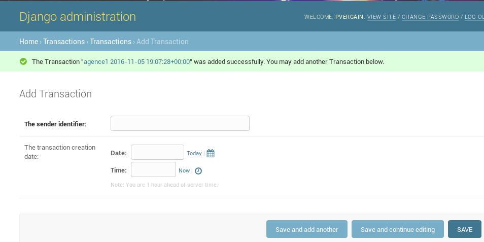

.. index::
   pair: Application ; transactions

.. _appli_transactions:

=========================================================		
The transactions Django application 
=========================================================

.. seealso::

   - :ref:`django_project` 
   - https://medium.com/@hakibenita/bullet-proofing-django-models-c080739be4e#.nmpia5992
   - http://steelkiwi.com/blog/best-practices-working-django-models-python/
   

.. contents::
   :depth: 3
   

python -m django startapp transactions alias python manage.py startapp transactions
====================================================================================

::

    python -m django startapp transactions

::

	(django_test_dates) django_test_dates/project_dates$ tree transactions
	
::
	
	transactions
	├── admin.py
	├── apps.py
	├── __init__.py
	├── migrations
	│   └── __init__.py
	├── models.py
	├── tests.py
	└── views.py

Advice for the Django models
============================

.. seealso::

   - https://medium.com/@hakibenita/bullet-proofing-django-models-c080739be4e#.nmpia5992

The `wonderful article`_ from Haki Benita.

.. _`wonderful article`: https://medium.com/@hakibenita/bullet-proofing-django-models-c080739be4e#.nmpia5992

.. _haki_benita:

Haki Benita 
------------

.. seealso::

   - https://medium.com/@hakibenita 
   - https://twitter.com/be_haki
   - https://medium.com/@hakibenita/bullet-proofing-django-models-c080739be4e#.nmpia5992		
   
   
Update the transactions/models.py module
=========================================

.. code-block:: python 

	#!/usr/bin/python
	# -*- coding: utf8 -*-
	"""

	"""
	import uuid

	from django.db import models

	class Transaction(models.Model):

		# https://docs.djangoproject.com/en/dev/ref/models/options
		class Meta:
			verbose_name = 'Transaction'
			verbose_name_plural = 'Transactions'
			# https://docs.djangoproject.com/en/dev/ref/models/options/#managed
			managed = True
			
			
		id = models.AutoField(
			primary_key=True,
		)
		
		# https://docs.djangoproject.com/en/dev/ref/models/fields/#uuidfield
		uid = models.UUIDField(
			unique=True,
			editable=False,
			default=uuid.uuid4,
			verbose_name='Public identifier',
		)
		
		# https://docs.djangoproject.com/en/dev/ref/models/fields/#charfield
		sender = models.CharField(
			max_length=200
			verbose_name="The sender identifier"        
		)    				
		# https://docs.djangoproject.com/en/dev/ref/models/fields/#DateTimeField
		created = models.DateTimeField(
			blank=True,
			verbose_name="The transaction creation date"
		)
		
		def __str__(self):
            return "{} {}".format(self.sender, self.created)

		def get_absolute_url(self):
			"""
			https://docs.djangoproject.com/en/dev/ref/class-based-views/generic-editing/
			"""
			return reverse('transactions:detail',
						   kwargs={'pk': self.pk})
						   
                       

Add the *transactions* application in the INSTALLED_APPS list
==============================================================

Update the project_dates/settings.py module::

	INSTALLED_APPS += [
		'transactions'
	]
	

python manage.py  check transactions
=====================================	
	
::
	
    (django_test_dates) project_dates$ python manage.py  check transactions
    
::
    
    System check identified no issues (0 silenced).

python manage.py makemigrations transactions
==============================================

::

	Migrations for 'transactions':
	  transactions/migrations/0001_initial.py:
		- Create model Transaction

The transactions/migrations/0001_initial.py module
---------------------------------------------------

.. code-block:: python
   :linenos:

	# -*- coding: utf-8 -*-
	# Generated by Django 1.10.3 on 2016-11-05 18:32
	from __future__ import unicode_literals

	from django.db import migrations, models
	import uuid

	class Migration(migrations.Migration):

		initial = True

		dependencies = [
		]

		operations = [
			migrations.CreateModel(
				name='Transaction',
				fields=[
					('id', models.AutoField(primary_key=True, serialize=False)),
					('uid', models.UUIDField(default=uuid.uuid4, editable=False, unique=True, verbose_name='Public identifier')),
					('sender', models.CharField(max_length=200, verbose_name='The sender identifier')),
					('created', models.DateTimeField(blank=True, verbose_name='The transaction creation date')),
				],
				options={
					'verbose_name': 'Transaction',
					'verbose_name_plural': 'Transactions',
					'managed': True,
				},
			),
		]

python manage.py sqlmigrate transactions 0001
===============================================

For information.

::

    (django_test_dates) project_dates$ python manage.py sqlmigrate transactions 0001
    
::
    
	BEGIN;
	--
	-- Create model Transaction
	--
	CREATE TABLE "transactions_transaction" ("id" integer NOT NULL PRIMARY KEY AUTOINCREMENT, "uid" char(32) NOT NULL UNIQUE, "sender" varchar(200) NOT NULL, "created" datetime NOT NULL);
	COMMIT;

python manage.py migrate transactions 
======================================

::

	Operations to perform:
	  Apply all migrations: transactions
	Running migrations:
	  Applying transactions.0001_initial... OK

python manage.py showmigrations
===============================

::

    (django_test_dates)assr38@vercors:~/Documents/django_test_dates/project_dates$ python manage.py showmigrations
    
::
    
	admin
	 [X] 0001_initial
	 [X] 0002_logentry_remove_auto_add
	auth
	 [X] 0001_initial
	 [X] 0002_alter_permission_name_max_length
	 [X] 0003_alter_user_email_max_length
	 [X] 0004_alter_user_username_opts
	 [X] 0005_alter_user_last_login_null
	 [X] 0006_require_contenttypes_0002
	 [X] 0007_alter_validators_add_error_messages
	 [X] 0008_alter_user_username_max_length
	contenttypes
	 [X] 0001_initial
	 [X] 0002_remove_content_type_name
	sessions
	 [X] 0001_initial
	transactions
	 [X] 0001_initial

python manage.py --help
========================

::

    (django_test_dates) project_dates$ python manage.py --help

::

	Type 'manage.py help <subcommand>' for help on a specific subcommand.

	Available subcommands:

	[auth]
		changepassword
		createsuperuser

	[django]
		check
		compilemessages
		createcachetable
		dbshell
		diffsettings
		dumpdata
		flush
		inspectdb
		loaddata
		makemessages
		makemigrations
		migrate
		sendtestemail
		shell
		showmigrations
		sqlflush
		sqlmigrate
		sqlsequencereset
		squashmigrations
		startapp
		startproject
		test
		testserver

	[sessions]
		clearsessions

	[staticfiles]
		collectstatic
		findstatic
		runserver

python manage.py createsuperuser
=================================

::

	Username (leave blank to use 'xx'): pvergain
	Email address: pvergain@gmail.com
	Password: 
	Password (again): 
	Superuser created successfully
	

The default urls.py module
===========================

.. code-block:: python
   :linenos:
   
   
	"""project_dates URL Configuration

	The `urlpatterns` list routes URLs to views. For more information please see:
		https://docs.djangoproject.com/en/1.10/topics/http/urls/
	Examples:
	Function views
		1. Add an import:  from my_app import views
		2. Add a URL to urlpatterns:  url(r'^$', views.home, name='home')
	Class-based views
		1. Add an import:  from other_app.views import Home
		2. Add a URL to urlpatterns:  url(r'^$', Home.as_view(), name='home')
	Including another URLconf
		1. Import the include() function: from django.conf.urls import url, include
		2. Add a URL to urlpatterns:  url(r'^blog/', include('blog.urls'))
	"""
	from django.conf.urls import url
	from django.contrib import admin

	urlpatterns = [
		url(r'^admin/', admin.site.urls),
	]

Update the transactions/admin.py module
========================================

.. code-block:: python
   :linenos:
   
   
    #!/usr/bin/python
	# -*- coding: UTF-8 -*-
	"""Transaction Administration.

	"""

	from django.contrib import admin

	from .models import Transaction

	@admin.register(Transaction)
	class TransactionAdmin(admin.ModelAdmin):
		"""Transaction administration

		Documentation
		=============

		- https://docs.djangoproject.com/en/dev/ref/contrib/admin/#modeladmin-objects

		"""
        date_hierarchy = 'created'		
		list_display = ('uid', 'sender', 'created')
		search_fields = ('uid', 'sender', 'created')
		list_filter = ('uid', 'sender', 'created')

Run the local web server on 127.0.0.1:8002
===========================================

::

	System check identified no issues (0 silenced).
	November 05, 2016 - 18:59:50
	Django version 1.10.3, using settings 'project_dates.settings'
	Starting development server at http://127.0.0.1:8002/
	Quit the server with CONTROL-C.
		

With Firefox go to 	http://127.0.0.1:8002/admin
	

Next step : use pendulum with shell_plus
==========================================

.. seealso::

   - https://django-extensions.readthedocs.io/en/latest/shell_plus.html#sql-queries
   
Prerequisites
--------------

.. seealso::

   - :ref:`install_django_extensions`
   - :ref:`install_ipython`

   
python manage.py shell_plus --print-sql
----------------------------------------

::
      
    (django_test_dates) project_dates$ python manage.py shell_plus --print-sql
    
::
    
	# Shell Plus Model Imports
	from django.contrib.admin.models import LogEntry
	from django.contrib.auth.models import Group, Permission, User
	from django.contrib.contenttypes.models import ContentType
	from django.contrib.sessions.models import Session
	from transactions.models import Transaction
	# Shell Plus Django Imports
	from django.db import transaction
	from django.conf import settings
	from django.utils import timezone
	from django.urls import reverse
	from django.core.cache import cache
	from django.db.models import Avg, Case, Count, F, Max, Min, Prefetch, Q, Sum, When
	Python 3.5.2 (default, Sep 10 2016, 08:21:44) 
	Type "copyright", "credits" or "license" for more information.

	IPython 5.1.0 -- An enhanced Interactive Python.
	?         -> Introduction and overview of IPython's features.
	%quickref -> Quick reference.
	help      -> Python's own help system.
	object?   -> Details about 'object', use 'object??' for extra details.

	In [1]: 
   
::
   
    In [1]: l=Transaction.objects.all()

::

    In [2]: l

::

	Out[2]: SELECT "transactions_transaction"."id", "transactions_transaction"."uid", "transactions_transaction"."sender", "transactions_transaction"."created" FROM "transactions_transaction" LIMIT 21

	Execution time: 0.000727s [Database: default]

	<QuerySet [<Transaction: agence1 2016-11-05 19:07:28+00:00>]>
	   

	
	   
   
		
		
